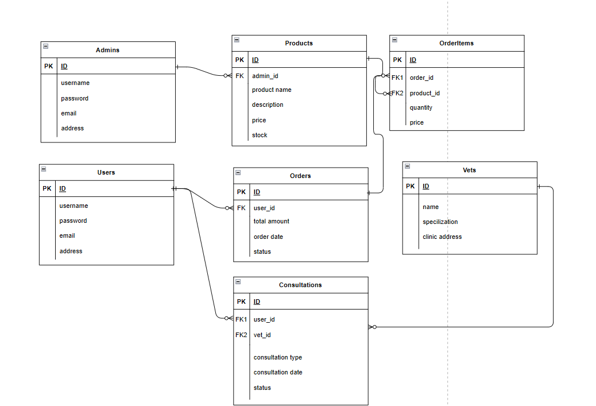

# PETPAL API

# 📑 About the Project

PetPal App adalah platform e-commerce khusus untuk kebutuhan hewan peliharaan. Aplikasi ini menyediakan berbagai fitur yang memudahkan pemilik hewan peliharaan untuk membeli barang dan berkonsultasi dengan dokter hewan, bisa dengan konsultasi online maupun kunjungan. Dengan UI yang user-friendly, PetPal App memungkinkan user untuk menemukan produk hewan yang berkualitas dan mendapatkan saran kesehatan dari dokter hewan profesional.

# 🎨 Prototype

[Figma](https://www.figma.com/design/hVqvSWqgOSIv9V0oWxO9NL/Untitled?node-id=0-1)

# 📄 Documentation (SwaggerHub)

[PetpalAPI](https://app.swaggerhub.com/apis-docs/WFHADIT/PETPAL/1.0.0)

# ERD

# Contributor

[Aditya Ramadhan](https://www.linkedin.com/in/adit6/)

[Bagas Alfaristo Putra](https://www.linkedin.com/in/bagas-alfaristo-putra/)
